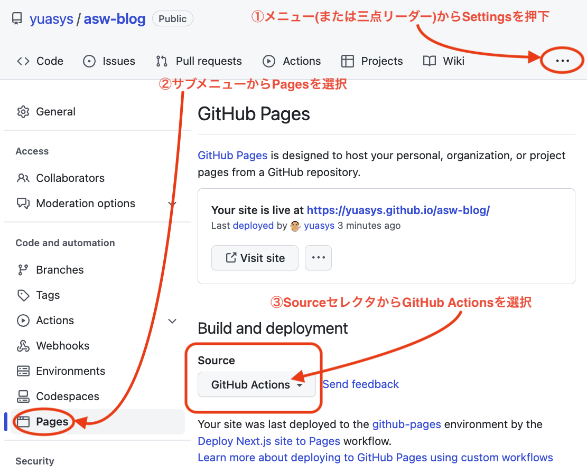

# README.md

This is a [Next.js](https://nextjs.org/) project bootstrapped with [`create-next-app`](https://github.com/vercel/next.js/tree/canary/packages/create-next-app)

## 次にやること：カスタマイズ

### Pages自動デプロイをActions（β版）で設定する

現時点2022-12-21での最新版「<b>Next.js 13</b>」で、GitHub-Pagesデプロイ自動化設定がとても簡単になりました。  
具体的には

上の図に従いGitHub Actionsを選択すると、自動でNext.jsの存在を認識してくれ「Nest．js設定」を推奨してくれるので、そこに表示されたボタンを押下して、現れた画面の緑色のボタン（コミットと確認の２つ）を押下してコミットするだけで、ほぼ<b>自動的に設定作業が済んでしまいます</b>。

### ファビコンをカスタマイズする

既定のファビコン画像などは<i>project-dir</i>/public/favicon.icoにあるので、同じディレクトリに表示したい画像を入れ、Next標準で内蔵されているHeadコンポネントに下記のようにコーディングするだけで実装出来る。  

[注意】画像までのpathは相対パスで書くと便利。実態ベースでpublic直下に置いたものは直接"<i>imagefile-name</i>"のように書く。  
"<i>/imagefile-name</i>"のように頭に"/"をつけると、ローカルでは上手く表示できるが、デプロイすると表示できないので注意する。  

```javascript
import Head from "next/head";
(中略）
      <Head>
        <title>ASW Blog | YUASYS nob</title>
        （中略）
       
        <link rel="icon" href="yuasys-logo.png" />
      </Head>


```

## Getting Started

First, run the development server:

```bash
npm run dev
# or
yarn dev
```

Open [http://localhost:3000](http://localhost:3000) with your browser to see the result.

You can start editing the page by modifying `pages/index.js`. The page auto-updates as you edit the file.

[API routes](https://nextjs.org/docs/api-routes/introduction) can be accessed on [http://localhost:3000/api/hello](http://localhost:3000/api/hello). This endpoint can be edited in `pages/api/hello.js`.

The `pages/api` directory is mapped to `/api/*`. Files in this directory are treated as [API routes](https://nextjs.org/docs/api-routes/introduction) instead of React pages.

## Learn More

To learn more about Next.js, take a look at the following resources:

- [Next.js Documentation](https://nextjs.org/docs) - learn about Next.js features and API.
- [Learn Next.js](https://nextjs.org/learn) - an interactive Next.js tutorial.

You can check out [the Next.js GitHub repository](https://github.com/vercel/next.js/) - your feedback and contributions are welcome!

## Deploy on Vercel

The easiest way to deploy your Next.js app is to use the [Vercel Platform](https://vercel.com/new?utm_medium=default-template&filter=next.js&utm_source=create-next-app&utm_campaign=create-next-app-readme) from the creators of Next.js.

Check out our [Next.js deployment documentation](https://nextjs.org/docs/deployment) for more details.
